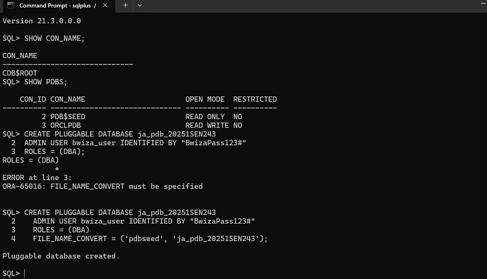
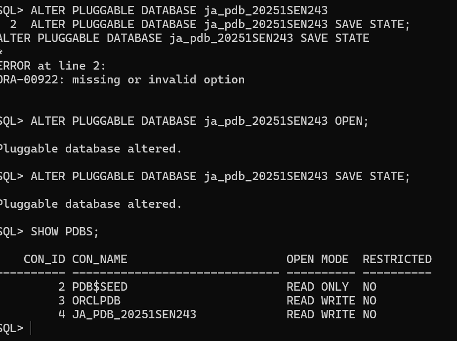
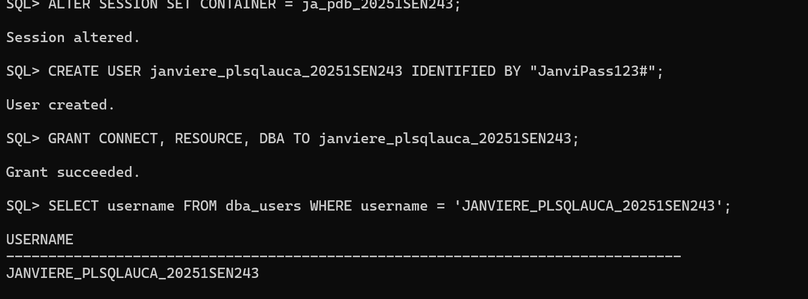
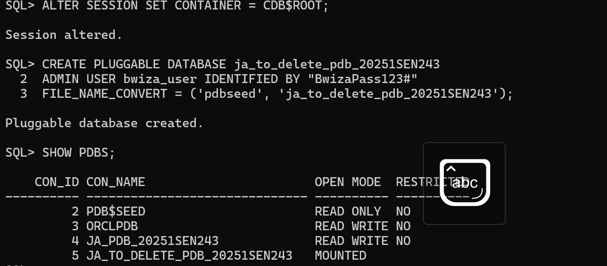
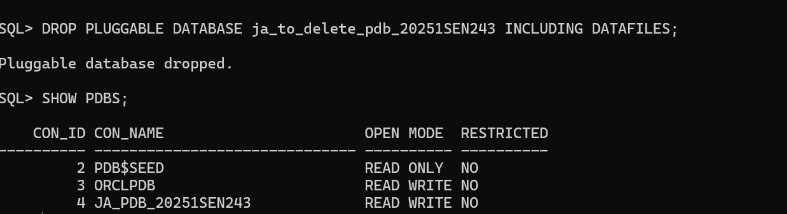
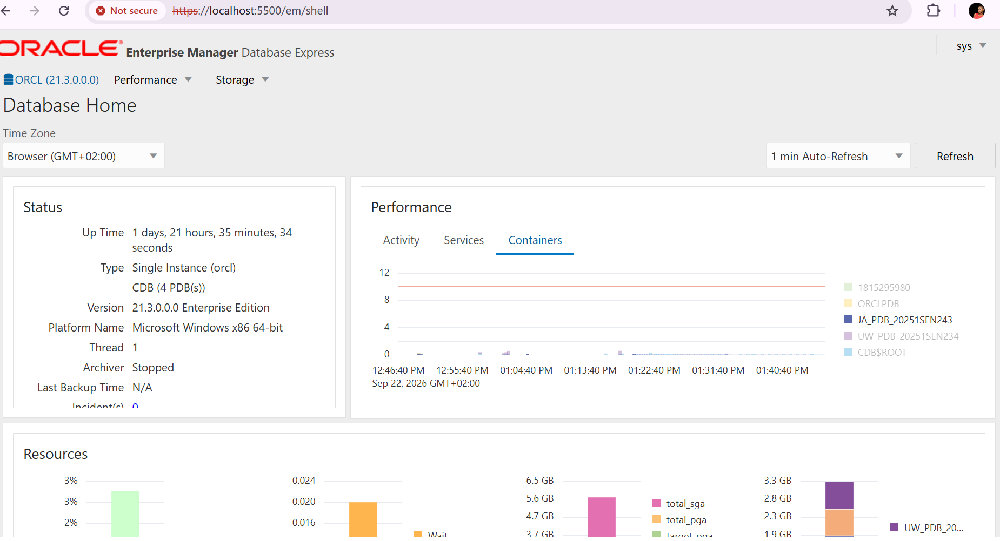

# Oracle Pluggable Database (PDB) Management Report

**Course:** Database Development with PL/SQL (INSY 8311)  
**Instructor:** Eric Maniraguha  
**Teaching Assistant:** Afanyu Emmanuel  
**Student Name:** Bwiza Janviere  
**Student ID:** 20251SEN243  

---

## Submission Details
- **Repository Link:** https://github.com/BWIZAjanvy/oracle_pdb_ass_II_20251SEN243_Janviere
- **PDB Name Created:** ja_pdb_20251SEN243
- **Issues Encountered:** Yes (Resolved ORA-65016 by specifying FILE_NAME_CONVERT)

---

## Overview
This repository contains the practical deliverables for Individual Assignment II on Oracle Multitenant Architecture. The tasks demonstrate PDB creation, lifecycle management, user management, and administration using Oracle Enterprise Manager (OEM) Express.

---

## Environment Details
- **Database Version:** Oracle Database 21c Enterprise Edition
- **Operating System:** Windows
- **Tooling Used:** SQL*Plus, Oracle Enterprise Manager (OEM) Express

---

## Tasks & Execution Summary

### Task 1: Create Main Pluggable Database & User
- Created primary PDB named `ja_pdb_20251SEN243`.
- Opened the PDB and saved its state across database restarts.
- Created local user `janviere_plsqlauca_20251SEN243` and granted `CONNECT`, `RESOURCE`, and `DBA` roles.

**Evidence:**

---

### Task 2: Temporary PDB Lifecycle (Create and Delete)
- Created temporary PDB named `ja_to_delete_pdb_20251SEN243`.
- Verified existence via `SHOW PDBS;`.
- Dropped the temporary PDB along with its datafiles (`INCLUDING DATAFILES`).
- Confirmed full removal from CDB dictionary.

**Evidence:**

---

### Task 3: Oracle Enterprise Manager (OEM)
- Accessed OEM Express web interface on port 5500.
- Verified database performance indicators and PDB status in the main dashboard.

**Evidence:**

---

## Challenges & Solutions
- **Challenge:** Encountered `ORA-65016: FILE_NAME_CONVERT must be specified` during initial PDB creation because Oracle Managed Files (OMF) was not enabled.
- **Solution:** Added `FILE_NAME_CONVERT = ('pdbseed', 'ja_pdb_20251SEN243')` to explicitly map file paths.

---

## Integrity Statement  
I hereby declare that all work presented in this repository is my own individual work carried out according to the guidelines specified for this assignment.
